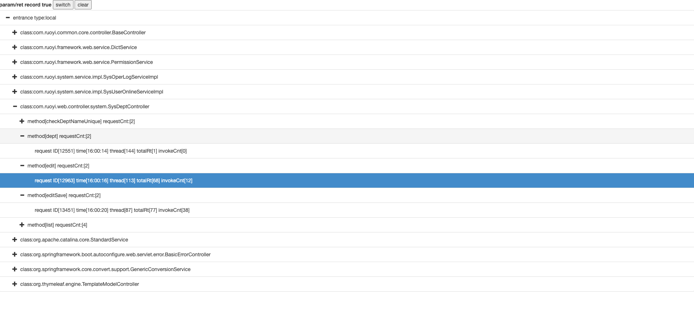
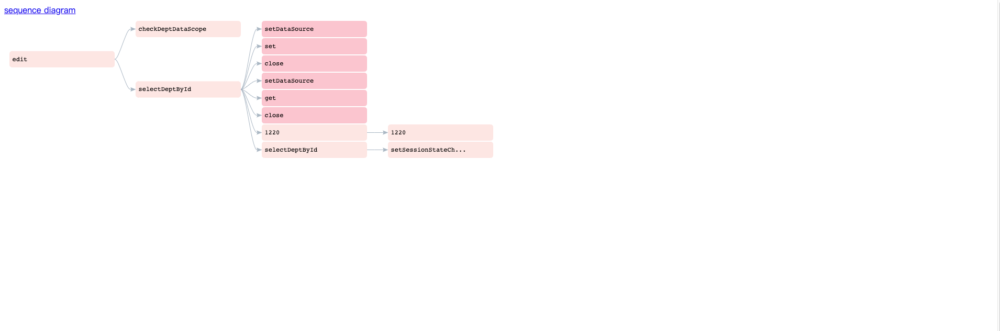
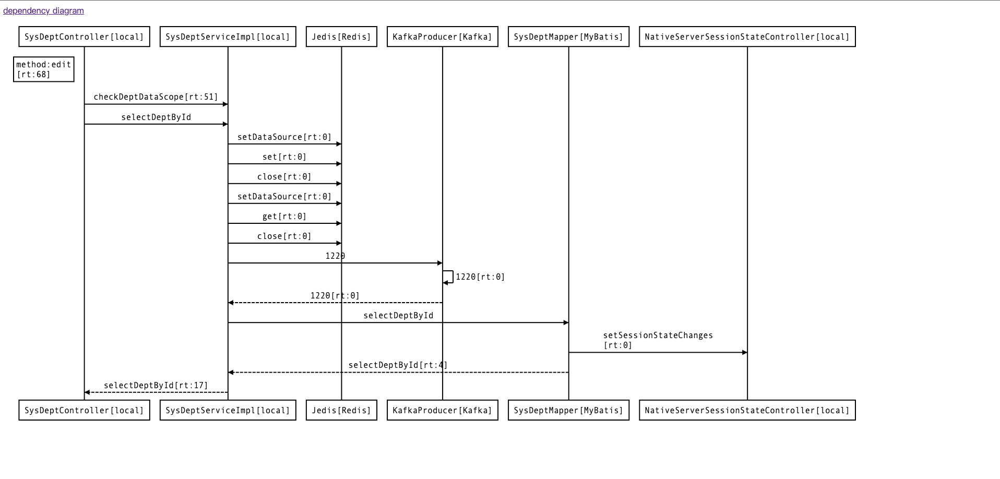

<h1 style="text-align: center">Insidious</h1>

####  项目简介

一个基于JVM-SandBox实现的trace系统

#### 打包部署

使用 mvn clean package -Dmaven.test.skip=true -X -Dmaven.javadoc.skip=true 打包后,在mac环境下jar包会自动放到.sandbox-module目录中（前提是有Jvm_Sandbox环境下），如果不能自动放入，则手动放入；linux环境下，参考JVM-SandBox部署

#### 启动
./sandbox.sh -p 应用进程 -P 端口 -R 例如 ./sandbox.sh -p 70026 -P 8601 -R

#### 数据接口
http://ip:port/sandbox/default/module/http/insidious/list
http://ip:port/sandbox/default/module/http/insidious/clear

#### 客户化页面
http://ip:port/sandbox/default/module/http/insidious/page/home

